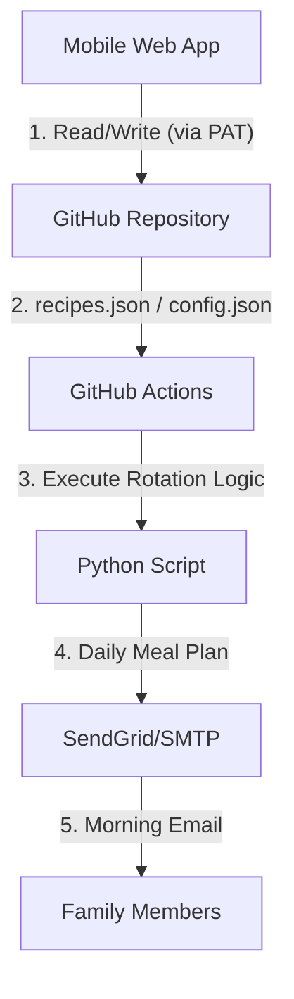
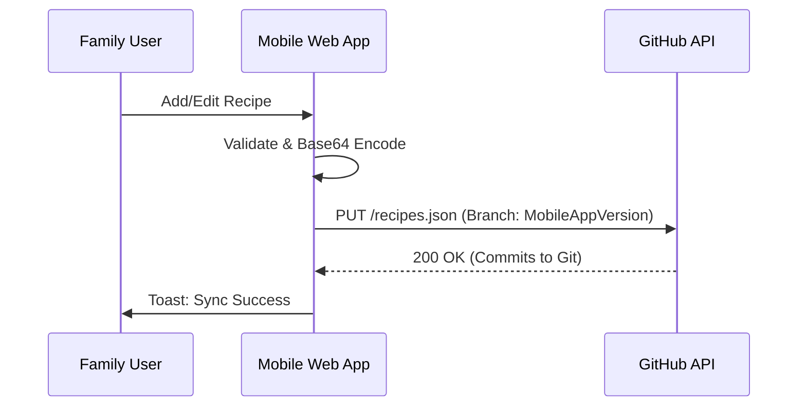
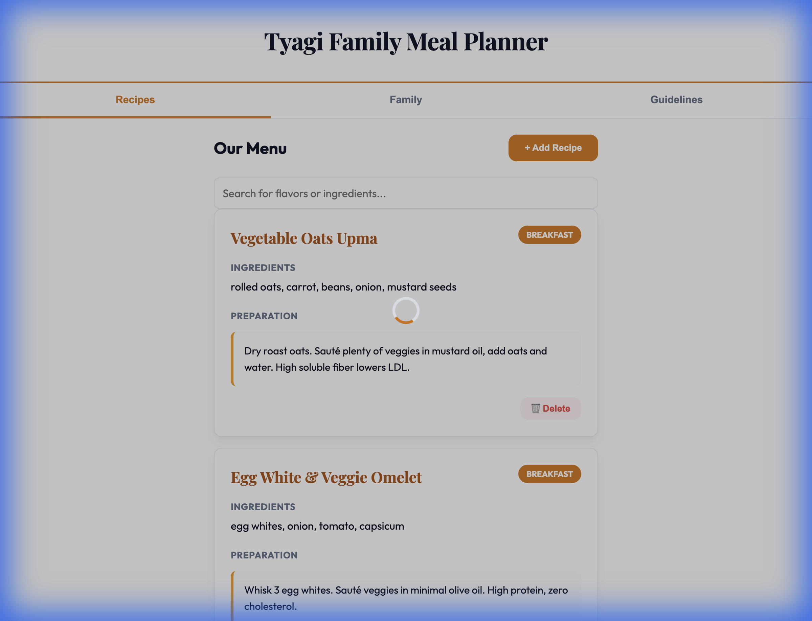
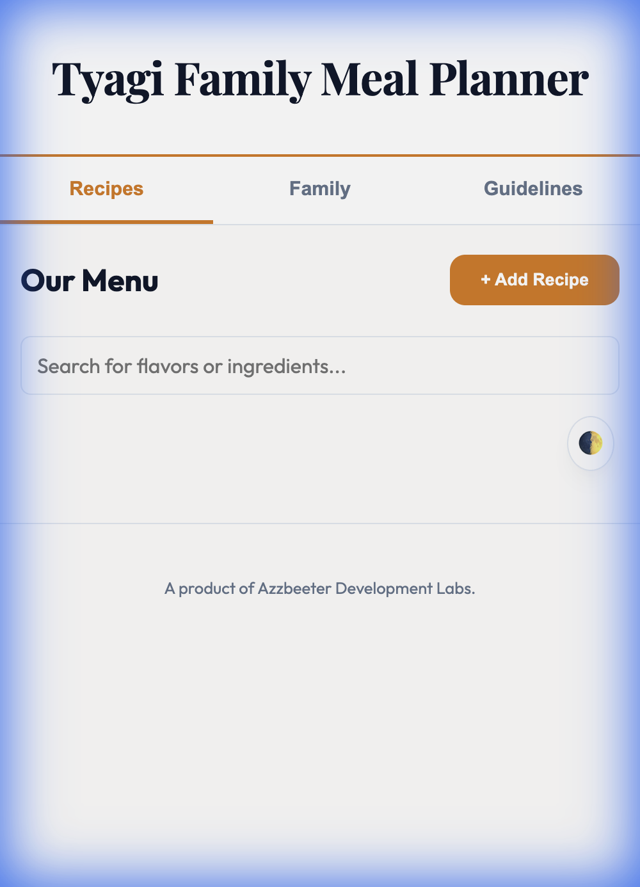
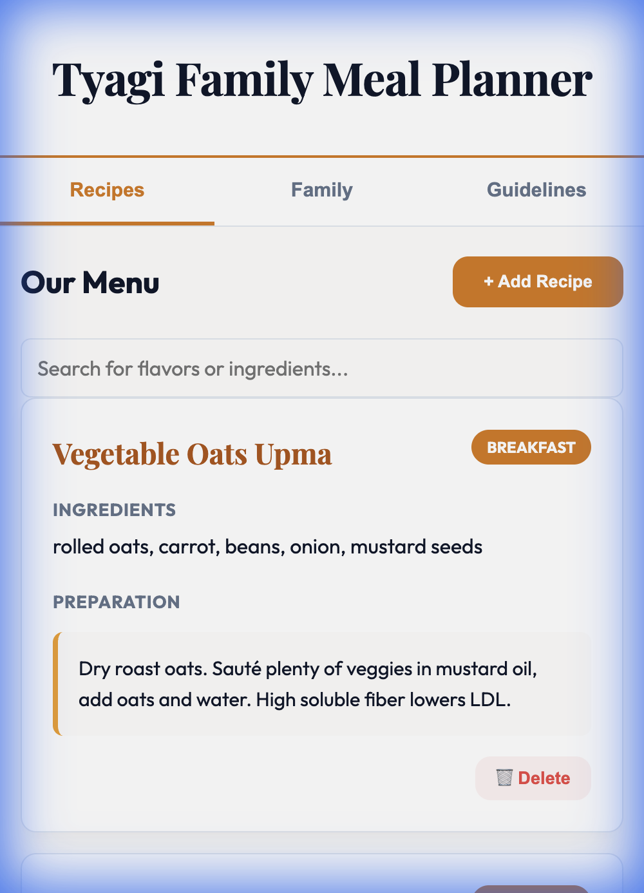

# 🥘 Tyagi Family Meal Planner

A premium, automated meal planning system designed for the Tyagi family. This project combines a mobile-first **Progressive Web App (PWA)** for manual recipe management with a **GitHub Actions-based automation** for daily meal rotation and email distribution.

---

## 🌟 Key Features

### 🍱 Gourmet Web App (PWA)
- **Luxury Aesthetic**: A sophisticated Slate and Amber gold theme with premium typography.
- **Recipe Management**: Full CRUD (Create, Read, Update, Delete) capability for family recipes.
- **Family Distribution**: Add or remove email recipients for daily planning.
- **Offline Reach**: Installable as a native app on iOS and Android via PWA support.
- **Gourmet Design**: Pixel-perfect layout across all platforms including specific fixes for iPhone 13 Safari alignment bugs.

### 🔄 Intelligent Automation
- **Daily Rotation**: Automated selection of Breakfast, Lunch, and Dinner.
- **No-Repeat Logic**: Ensures recipes don't repeat from the previous day.
- **Morning Briefing**: Emails sent every morning at **7:00 AM IST**.
- **Grocery Foresight**: Daily emails include tomorrow's ingredients for proactive shopping.

---

## 🏗️ Architecture & Flows

### System Overview

### Data Sync Strategy
The app uses a **Zero-Server** architecture. All data is persisted directly in your GitHub repository as structured JSON files.

---

## 📸 App Interface

| Light Mode | Dark Mode |
|------------|-----------|
|  |  |

### 📋 Usage Guidelines

---

## 🔒 Security & Persistent Sync

To maintain maximum security while allowing family-wide access:
- **Token-on-Demand**: The GitHub Personal Access Token (PAT) is provided once by the user and stored locally on the device (`localStorage`).
- **No Hardcoded Secrets**: Sensitive credentials never touch the source code in plain text.
- **Cache-Busting**: The app uses timestamp-based request parameters to ensure users always see live data, even with aggressive browser caching on iOS.

---

## 🚀 Setup & Installation (Developer Only)

For detailed instructions on repository configuration, hosting, and secret management, refer to the **[DEVELOPER_SETUP.md](DEVELOPER_SETUP.md)** guide.

1. **Pages**: Set GitHub Pages to build from the `docs/` folder on the `MobileAppVersion` branch.
2. **Secrets**: Ensure `SENDGRID_API_KEY` is set in GitHub Repository Secrets.
3. **App**: Open the Pages URL and enter your PAT to begin syncing.

---

## 🛠️ Technology Stack
- **Frontend**: Vanilla HTML5, CSS3 (Variables, Flexbox, Grid), JavaScript (ES6+ App Logic).
- **Backend**: GitHub API v3, GitHub Pages.
- **Automation**: Python 3.x, GitHub Actions.
- **Iconography**: Custom PWA manifest icons for mobile native experience.

---

*A product of Azzbeeter Development Labs.*